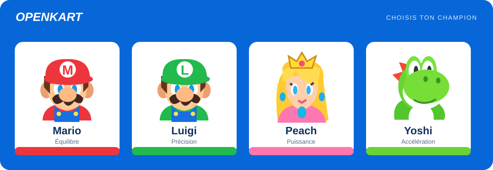
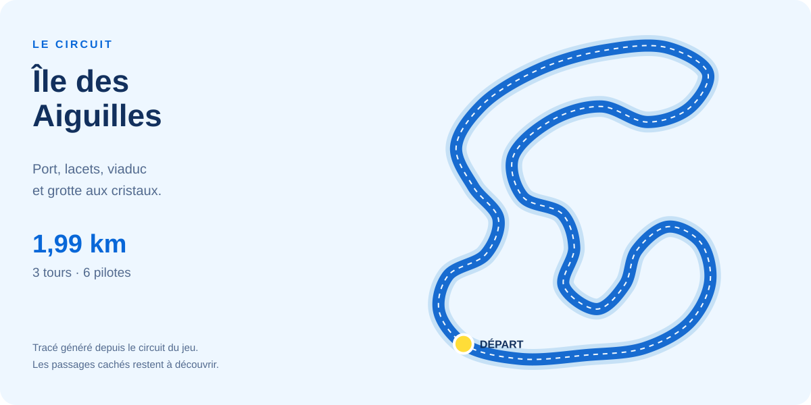

# OpenKart

**Circuit : Île des Aiguilles** · [codesimple-lab/openkart](https://github.com/codesimple-lab/openkart)

OpenKart est un fan game de kart 3D créé de zéro avec TypeScript, Three.js et Vite. Référence directe : Mario Kart 8 Deluxe, avec Mario, Luigi, Peach et Yoshi, une île originale et un téléphone comme manette. Les modèles et illustrations sont construits en code dans le projet.





*Illustrations générées depuis les portraits et le tracé du jeu. Les raccourcis cachés ne sont pas dévoilés.*

## Jouer

Node.js 22 ou version plus récente.

```sh
git clone https://github.com/codesimple-lab/openkart.git
cd openkart
npm ci
npm run dev
```

Ouvrir **http://localhost:5180** sur l’ordinateur. Le rendu nécessite WebGL 2 et l’accélération graphique du navigateur. Des versions précédentes ont été vérifiées visuellement dans Brave ; les vérifications de la version courante sont décrites dans [VALIDATION.md](VALIDATION.md).

## Téléphone comme manette

1. Brancher l’ordinateur et le téléphone au **même Wi-Fi**.
2. Dans le garage, choisir **Mon téléphone**.
3. Scanner le QR code affiché avec le téléphone.
4. Choisir **Piloter en inclinant** sur HTTPS, ou **Utiliser les boutons**, puis **Lancer la course**.
5. Tenir une flèche et **GAZ** simultanément pour accélérer. **FREIN** ralentit, puis permet de reculer. **DRIFT** charge un turbo qui se déclenche quand on relâche. **OBJET** utilise les pouvoirs. Pour une banane ou une carapace, maintenir protège derrière le kart, relâcher lance devant. **ARRIÈRE** fait le même geste avec un tir arrière.

Aucune installation sur le téléphone. Le mode tactile fonctionne sur HTTP, en portrait ou en paysage. Le paysage laisse plus de place aux doigts. L’adresse IP est détectée automatiquement ; `DELTA_LAN_IP=192.168.x.x npm run dev` permet de la préciser sur un ordinateur avec plusieurs interfaces réseau. Le serveur doit rester ouvert et le port 5180 accessible depuis le réseau local.

Si la manette ne transmet plus de commandes pendant 600 ms, la course se met en pause. Reconnecter et reprendre, ou choisir **Continuer au clavier**. Garder l’onglet du jeu visible sur l’ordinateur.

### Piloter avec le gyroscope

```sh
npm run dev:phone
```

Ouvrir **https://localhost:5181** sur l’ordinateur, choisir **Mon téléphone**, puis scanner **le QR code de cette page HTTPS**. Le serveur HTTP sur 5180 et ce serveur HTTPS possèdent des sessions distinctes. Le QR HTTP ne permet pas d’utiliser les capteurs sur le téléphone.

Sur le téléphone :

1. Ouvrir le lien dans Safari ou Chrome et choisir **PILOTER EN INCLINANT**.
2. Autoriser l’accès au mouvement lorsque le navigateur le demande.
3. Tenir le téléphone en paysage, légèrement redressé comme un volant, et rester immobile environ une demi-seconde.
4. Incliner pour tourner, maintenir **GAZ** pour accélérer et **DRIFT** pour déraper.
5. Utiliser **RECENTRER** pour changer la position neutre ; choisir une sensibilité **Douce**, **Normale** ou **Vive**. **Inverser** change le sens de direction si nécessaire.

Le calcul tient compte des deux orientations paysage et du portrait. Une petite zone neutre et un filtre atténuent les tremblements. Un téléphone posé complètement à plat ne fournit pas un angle de volant stable : le redresser. Les flèches tactiles restent utilisables ; **TACTILE** désactive les capteurs.

Cette variante utilise un certificat de développement local incluant l’adresse réseau du Mac. Sa validation éventuelle dans le navigateur reste manuelle. Un certificat non approuvé peut empêcher le navigateur d’accorder l’accès aux capteurs. Pour un hébergement distant, utiliser HTTPS avec un certificat reconnu et conserver le relais WebSocket. [Conditions d’accès aux capteurs](https://developer.mozilla.org/en-US/docs/Web/API/DeviceOrientationEvent/requestPermission_static).

`npm run dev:https` reste disponible sur 5180 à la place du serveur HTTP. `OPENKART_LAN_IP` permet de préciser l’interface réseau ; l’ancien nom `DELTA_LAN_IP` reste accepté.

### Reprise après interruption

Les boutons sont relâchés lors d’une perte de focus, d’une mise en veille ou d’une pause. Le retour à la page rétablit la connexion et recale le gyroscope ; la course attend une reprise explicite. Le même onglet peut remplacer son ancienne connexion bloquée sans attendre son expiration. Une autre manette ne peut pas l’évincer. Une connexion sans réponse ou accumulant des commandes est recréée, sans rejouer les anciens appuis.

Si le capteur s’interrompt, la direction revient au neutre et les gaz sont coupés ; la course reçoit une demande de pause. Les tests automatisés couvrent les commandes, les permissions et ces interruptions. La validation sur un téléphone physique reste à effectuer.

## Contenu

- **Un circuit de 1,99 km**, l’Île des Aiguilles : port, montée en lacets, viaduc continu, deux embranchements routiers et tunnel. Trois tours, cinq adversaires.
- **Quatre personnages** : Mario, Luigi, Peach et Yoshi, avec portraits illustrés, modèles 3D reconnaissables et statistiques différentes.
- Karts à matériaux physiques, roues animées, braquage, ombres, mer animée, végétation et relief procédural.
- **Objets** : champignon, banane, carapace verte, carapace rouge, Super Étoile et Super Klaxon. Deux emplacements, roulette, projectiles visibles et boîtes multicolores qui réapparaissent après ramassage. Leur détection suit la rotation et le flottement du cube, ainsi que le volume orienté du kart, avec contact continu à grande vitesse.
- **Pièces à ramasser** sur le circuit, compteur limité à 10, bonus de vitesse et perte de pièces après impact.
- **Décors** : port pavé, 14 îlots à arcades, balcons, 4 pavillons, porte à deux tours, tribunes, champignons géants, tuyaux, palmiers, montgolfières, fanions animés et grotte aux cristaux.
- Conduite avec inertie de direction, adhérence limitée, glissade et effet des pentes. Drift engagé par un saut, côté conservé pendant le maintien et contre-braquage pour élargir le virage. Trois paliers de mini-turbo : bleu, orange, violet ; déclenchement au relâchement. Joueur et adversaires utilisent la même physique et les mêmes bonus de vitesse.
- Contacts entre volumes orientés des karts, transfert de vitesse, frottement contre les glissières, suspension, étincelles et traces de pneus.
- Route continue suivant le dévers : asphalte, bordures, marquages et glissières ; piles de pont, murs de soutènement, quais et mobilier.
- **Deux passages cachés** : accès sans panneaux, dissimulés par des rochers et du feuillage ; sol patiné, pièces et accélérateurs à l’intérieur. Ils ne sont pas dessinés sur la mini-carte. Le gain dépend de la trajectoire et des accélérateurs empruntés.
- **Coupe dans l’herbe**, sans panneau et avec quelques pièces dissimulées à l’intérieur : ralentissement progressif sans boost, passage rapide avec champignon ou étoile. Les glissières et collisions suivent son élargissement.
- Sons de moteurs et pneus enregistrés, impacts distincts, adversaires en stéréo, alerte de carapace rouge, vagues et réverbération du tunnel. **MIXAGE** règle moteurs, bruitages, ambiance et musique. [Sources et licences](CREDITS_AUDIO.md). Si le départ vient du téléphone, cliquer **ACTIVER LE SON** sur l’ordinateur au besoin.
- Mini-carte, classement, chronomètre, temps par tour, pause, reprise et nouvelle course. Les petits événements de conduite restent sonores et visuels : aucun texte central « CONTACT », « GLISSIÈRE », « BOÎTE RAMASSÉE » ni annonce systématique des objets/turbos.
- Manette tactile avec plusieurs doigts, appairage QR, code de session, télémétrie et reconnexion.

C’est un **prototype arcade avec une direction visuelle stylisée**, pas une simulation automobile ni un rendu photoréaliste. Les représentations des personnages, les icônes et les décors sont générés en code ; le tracé est propre à ce projet. La caméra et le quartier du port ont aussi été retravaillés à partir de la partie basse de la [référence vidéo fournie](https://www.instagram.com/p/Dc4UM6NKZkJ/), pour l’échelle du kart et la densité architecturale. La trajectoire est simulée dans les coordonnées du circuit ; la piste conserve des glissières pour une conduite accessible.

## Gestes de course

- **Départ turbo** : commencer à accélérer quand le compte à rebours affiche 2, puis maintenir. Partir trop tôt fait caler brièvement le moteur.
- **Drift** : à bonne vitesse, presser Espace (ou DRIFT sur téléphone) en tournant. Maintenir ce bouton ; tourner dans le sens du drift pour resserrer, dans le sens opposé pour élargir. Revenir au centre ne termine plus le drift.
- **Mini-turbo** : relâcher DRIFT après apparition des étincelles. Bleu = court, orange = moyen, violet = long. Le son et la jauge suivent les mêmes paliers.
- **Objets défensifs** : maintenir E équipe une banane ou carapace derrière le kart ; relâcher la lance devant. B protège puis lance derrière. Un appui bref suivi du relâchement suffit pour tirer.

## Clavier

| Action | Touches |
|---|---|
| Accélérer | Z / W / ↑ |
| Freiner, reculer | S / ↓ |
| Tourner | Q / A / D / ← / → |
| Petit saut pour engager le drift | Espace ou Maj |
| Objet / maintien de protection / lancer avant au relâchement | E |
| Objet / maintien de protection / lancer arrière au relâchement | B |
| Se replacer sur la piste | R |
| Pause | P / Échap |

## Vérification

La suite de tests couvre la conduite, les contacts, les objets, la géométrie de la route et les commandes. Les collisions des projectiles sont vérifiées à 30, 60 et 120 mises à jour par seconde. Le résultat de la dernière exécution est indiqué dans [VALIDATION.md](VALIDATION.md).

Les anciens chronos d’équilibrage précédaient les nouveaux embranchements. Ils ne mesurent donc pas les gains des branches actuelles.

Le mode de développement `/?demo=1` lance une course avec pilotage automatique, explicitement étiquetée. Les points de contrôle figés `/?inspect=curve`, `tunnel`, `bridge`, `items`, `shortcut`, `orchard` et `ridge` servent à inspecter le rendu. `orchard` et `ridge` placent le kart au milieu de chaque branche, au sol. Revenir à `/` pour jouer normalement.

```sh
npm test
npm run build
# Avec le serveur lancé dans un autre terminal :
npm run test:relay
```

Les tests couvrent le bouclage du circuit, les dégagements entre ses portions, une course complète avec les adversaires, les branches routières, le drift, les tours en marche arrière et la saisie multitactile. Le test du relais ouvre de vraies connexions WebSocket et vérifie appairage, commandes, lancement à distance, télémétrie, rejet des messages invalides, déconnexion et reconnexion.

Pour lancer la version compilée, arrêter le serveur de développement puis :

```sh
npm run preview
```

Le relais téléphone est également disponible avec `preview`. Un simple hébergement des fichiers statiques `dist/` permet le rendu mais **ne remplace pas le serveur WebSocket nécessaire à la manette**.

## Organisation

- `src/game/course.ts` : tracé et échantillonnage du circuit.
- `src/game/race.ts` : déroulement de course, drift et choix de route.
- `src/game/vehicle-physics.ts`, `arcade-handling.ts`, `rocket-start.ts`, `ai-driver.ts`, `contacts.ts` : conduite, drift, départ turbo, adversaires et collisions.
- `src/game/world.ts`, `harbor-district.ts` et `festival-scenery.ts` : terrain, route, ciel, mer et décors.
- `src/game/items.ts`, `combat.ts` et `collectible-visuals.ts` : pièces, boîtes, trajectoires et collisions des projectiles.
- `src/game/road-geometry.ts` : surfaces, marquages et repère commun à la route et aux karts.
- `src/game/chase-camera.ts` et `driving-effects.ts` : caméra, traces de pneus et étincelles.
- `src/game/item-types.ts` : icônes SVG et noms des objets, partagés avec la manette.
- `src/game/driver-portraits.ts` : portraits SVG des personnages.
- `src/game/audio.ts` et `audio-model.ts` : mixage, spatialisation et sons ; `public/audio/` contient la banque documentée.
- `src/game/kart.ts` et `kart-surfaces.ts` : modèles des pilotes et karts.
- `src/game/game.ts` : boucle de jeu, caméra et gestion de course.
- `src/controller/` : interface téléphone, tactile et gyroscope.
- `src/network/` : protocole et connexion de l’ordinateur.
- `vite.config.ts` : serveur local et relais de sessions.

Aucun compte, aucune publication et aucun service externe ne sont nécessaires pour jouer sur le Wi-Fi local.

## Références de conception

- [Présentation et captures officielles Mario Kart 8 Deluxe](https://www.nintendo.com/au/games/nintendo-switch/mario-kart-8-deluxe/) : direction visuelle et organisation de la course.
- [Objets — Nintendo](https://www.nintendo.com/sg/switch/aabp/item/index.html) : deux objets, pièces, champignons, bananes et carapaces. Les probabilités et réglages de cette version restent propres au prototype.

Les gestes et les paliers prennent pour référence le [guide de techniques publié par Nintendo](https://www.nintendo.com/jp/ichikara/aabpa/index_en.html). Les valeurs de vitesse, de charge et de durée sont réglées pour ce circuit.
